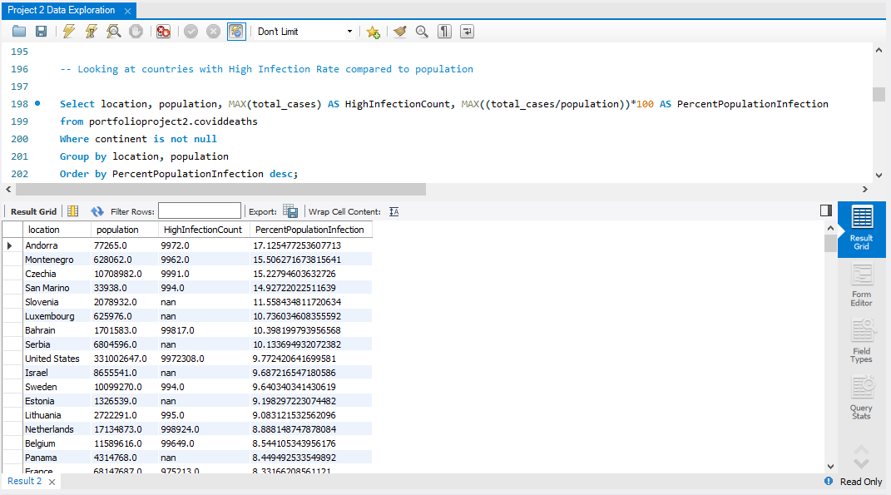

# COVID-19 Data Exploration Using SQL

## Project Preview

## Project Overview

This project explores global COVID-19 data using SQL to extract meaningful business insights from a real-world dataset. The analysis focuses on understanding infection rates, death counts, vaccination progress, and global pandemic trends through exploratory data analysis.

The project demonstrates how SQL can be used not only to retrieve data but also to solve business problems, perform trend analysis, and generate actionable insights from large datasets.

## Why I Chose This Project

I selected this project because the COVID-19 dataset contains a large volume of real-world data that provides an excellent opportunity to practice exploratory data analysis using SQL.

This project allowed me to:
- Work with a complex and real-world dataset.
- Practice advanced SQL concepts beyond basic queries.
- Answer business-oriented analytical questions.
- Improve my problem-solving and analytical thinking skills.
- Build a portfolio project that demonstrates practical SQL knowledge.

## Dataset Information

The project uses two datasets:

- CovidDeaths – Contains information about confirmed COVID-19 cases, deaths, population, and geographical details.
- CovidVaccinations – Contains daily vaccination records for different countries.

These datasets are joined together to analyze vaccination progress alongside COVID-19 statistics.

## Business Problem

The COVID-19 pandemic affected countries across the world in different ways. Governments, healthcare organizations, and researchers needed reliable data to understand:

- Which countries had the highest infection rates?
- Which countries recorded the highest death counts?
- How did vaccination campaigns progress over time?
- How did different continents compare?
- What were the global COVID-19 trends throughout the pandemic?

This project answers these questions using SQL.

# Business Questions Answered

The project explores the following business questions:

- What data is available for COVID-19 deaths and vaccinations?
- What was the likelihood of dying after contracting COVID-19 in the United States?
- What percentage of the United States population was infected?
- Which countries had the highest infection rate compared to their population?
- Which countries recorded the highest total number of deaths?
- Which continents recorded the highest death count?
- How did global COVID-19 cases and deaths change over time?
- What were the overall global COVID-19 statistics?
- How did vaccination campaigns progress over time?
- What percentage of each country's population received COVID-19 vaccinations?

## SQL Skills Demonstrated

This project demonstrates the use of:

- Data Exploration
- Data Filtering (`WHERE`)
- Sorting (`ORDER BY`)
- Aggregate Functions (`SUM`, `MAX`)
- `GROUP BY`
- `JOIN`
- Window Functions
- Rolling Calculations
- Common Table Expressions (CTEs)
- Temporary Tables
- Views
- Data Cleaning using `CAST`, `NULLIF`, and `COALESCE`

## Key Insights

Some of the insights generated from this project include:

- Countries with the highest COVID-19 infection rates.
- Countries with the highest reported deaths.
- Death count comparison across continents.
- Daily global COVID-19 trends.
- Overall global pandemic statistics.
- Running vaccination totals by country.
- Vaccination percentage relative to population.

## Project Results

The query outputs and analysis screenshots are available in the **Results** folder.

## Project Structure

SQL Data Exploration/
│
├── Dataset/
│   ├── CovidDeaths.csv
│   └── CovidVaccinations.csv
│
├── SQL Script/
│   └── Project 2 Data Exploration.sql
│
├── Results/
│   ├── Query Output Images
│
├── README.md
└── LICENSE

## What I Learned

Through this project, I gained hands-on experience in:

- Exploring and analyzing real-world datasets.
- Writing optimized SQL queries.
- Solving business problems using SQL.
- Using Window Functions for cumulative calculations.
- Building reusable queries with CTEs, Temporary Tables, and Views.
- Documenting SQL queries with business explanations.
- Improving analytical thinking through exploratory data analysis.

## Future Improvements

Future enhancements for this project include:

- Building an interactive Power BI dashboard using the analyzed data.
- Performing deeper trend analysis.
- Creating additional KPIs and performance metrics.
- Optimizing SQL queries for larger datasets.

## Author

Kaushikee Sharma

Aspiring Data Analyst passionate about transforming raw data into meaningful business insights through SQL, Excel, Power BI, and Python.
